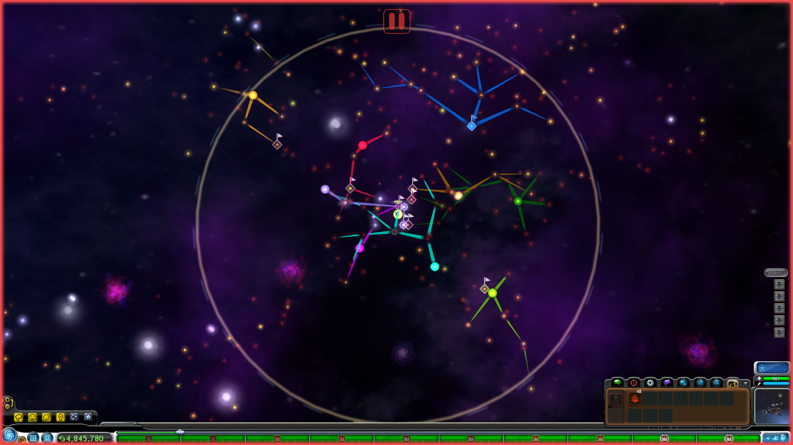
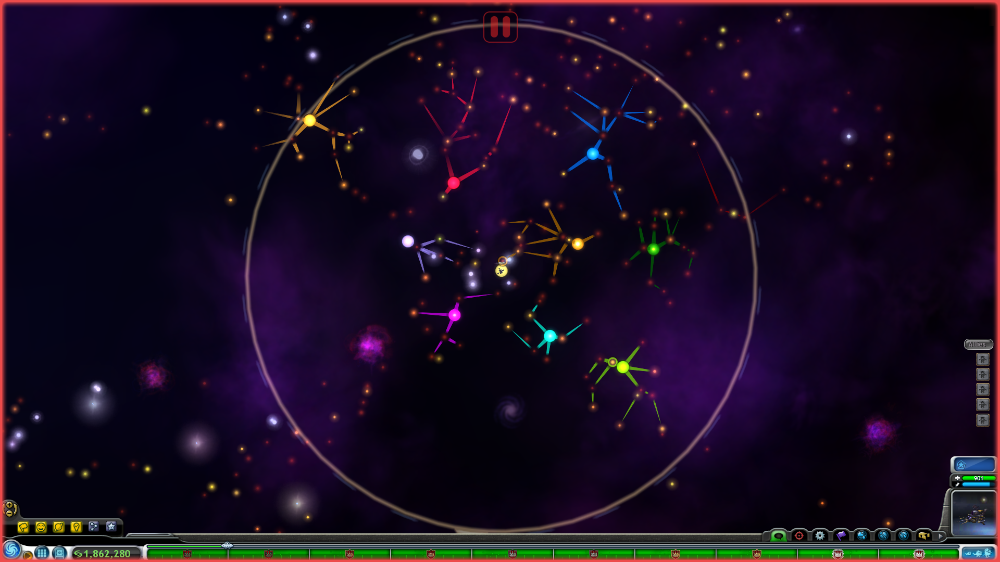

# Sensible AI Colonization

This mod improves how AI empires expand during the Space Stage.

In the vanilla game, AI colonization is slow, illogical, and often leads to empires merging together, making it impossible to maintain any kind of visual frontier between them. On top of that, the AI doesn't seem to care about spice types or the planet's terrascore, often picking the worst planet in a system to colonize.  
This mod fixes that by making empires expand in a more cohesive and strategic way.

### Features

- AI empires prioritize nearby systems, expanding in clusters and avoiding isolated colonies.
- Empires favor systems with high-value spice types and/or habitable planets.
- When colonizing a star system, the AI will always pick the best planet available.
- Once an empire reaches a high enough strength factor, it will start conquering systems inhabited by tribes or civilizations.
- The speed at which empires expand can be customized when the mod is installed.
- AI avoids colonizing special systems like Sol, systems with monoliths, save file stars, etc.
- The Grox and empires from other saves are not affected by this mod.

## Comparison

| Without the mod | With the mod |
|------------------|--------------|
|  |  |

Both screenshots were taken after 1 hour and 30 minutes at fast speed.

---
